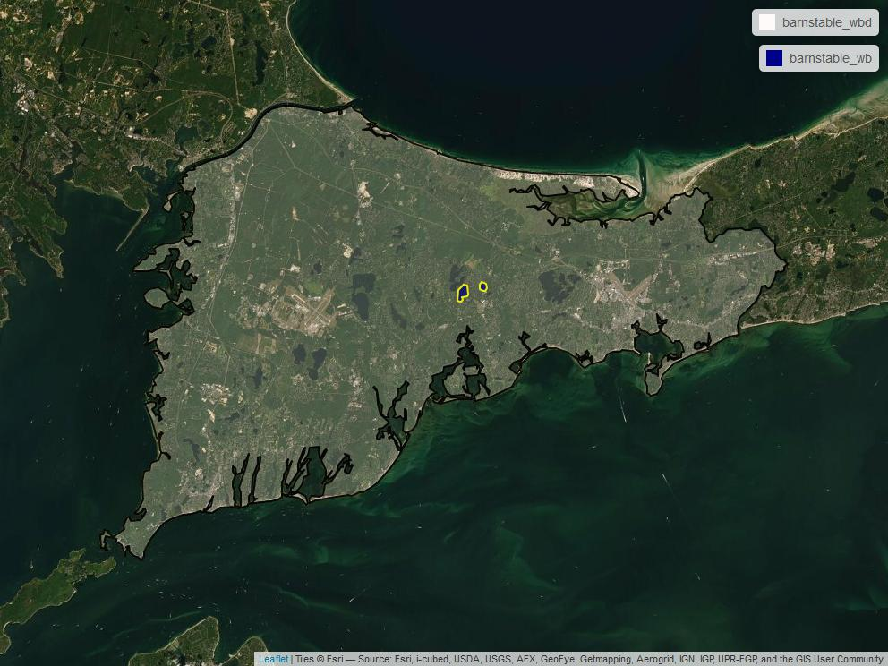
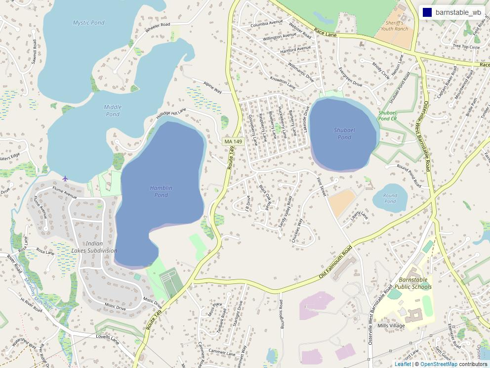
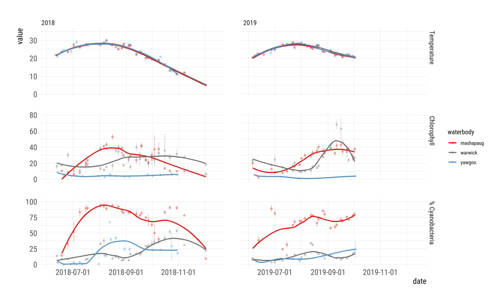
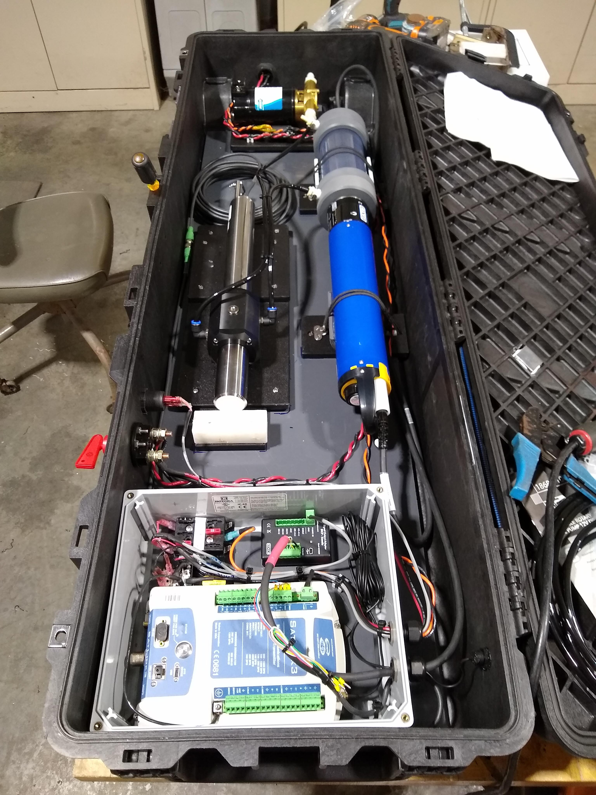
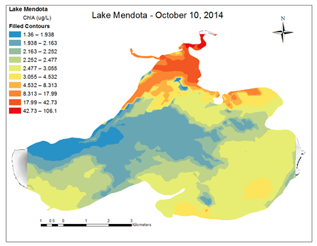
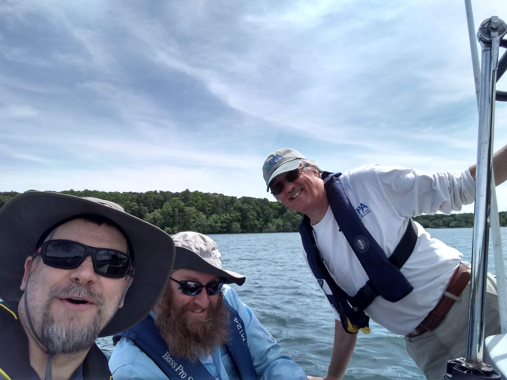
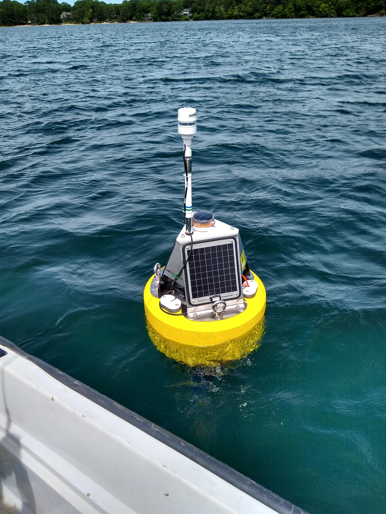

```{r setup, include=FALSE}
knitr::opts_chunk$set(echo = FALSE)
```

<style>
.forceBreak { -webkit-column-break-after: always; break-after: column; }
</style>


## Where, When

- Shubael Pond and Hamblin Pond
  - Compliments SDR
  - [A-pod](https://ppodtech.com/)
- June to November
  - Started 2021

<center> 
  
```{r echo=FALSE, message=FALSE, fig.fullwidth=TRUE, fig.width= 8}
library(sf)
library(mapview)
library(dplyr)
barnstable_wbd <- 
  st_read(here::here("data/nsink_data/01a/wbd/WBD_Subwatershed.shp"), 
          quiet = TRUE) %>% 
  st_zm() %>%
  dplyr::filter(HUC_12 == "010900020206")
barnstable_wb <- 
  st_read(here::here("data/nsink_data/01a/nhd/NHDWaterbody.shp"), 
          quiet = TRUE) %>%
  st_zm() %>%
  dplyr::filter(GNIS_NAME %in% c("Shubael Pond", "Hamblin Pond"))
map1 <- mapview(barnstable_wbd, map.types = "Esri.WorldImagery", 
        color = "black", col.regions = "snow", alpha.regions = 0.2, lwd = 2) + 
  mapview(barnstable_wb, col.regions = "dark blue", lwd = 2, color = "yellow")
map1sh <- mapshot(map1, file = here::here("figures/coarse_cape_map.jpg"))

map2 <- mapview(barnstable_wb, map.types = "OpenStreetMap",
        color = "dark blue", col.regions = "dark blue", alpha.regions = 0.25, 
        lwd = 0)
map2sh <- mapshot(map2, file = here::here("figures/cape_pond_map.jpg"))
```





</center>

## Why High Resolution?

- Why High Resolution?
  - We know the general process
  - Don't know fine scale triggers

<center>

```{r echo=FALSE, message=FALSE, warning=FALSE, fig.width=8}
################################################################################
# Load up packages in R session

library(ggplot2)
library(dplyr)
library(readr)
library(plotly)

################################################################################
# Get Data: The data we need is available from the National Aquatic Resource
# Survey's website First we can get the dataset that we have saved as a `.csv`
# in this repository.

nla_wq_all <- read_csv("https://www.epa.gov/sites/production/files/2014-10/nla2007_chemical_conditionestimates_20091123.csv")

################################################################################
# Manipulate Data: Let's tidy up this dataset by turning all column names to
# lower case (Jeff likes it that way), convert all text in the dataset to lower
# case (again Jeff likes it like that way and it is kind of a hot mess
# otherwise), filter out just the probability samples and the first visits, and
# select a subset of columns.

nla_wq <- nla_wq_all %>%
  rename_all(tolower) %>% #making all names lower case beucase they are a mess!
  mutate_if(is.character, tolower) %>%
  filter(site_type == "prob_lake",
         visit_no == 1) %>%
  select(site_id, st, epa_reg, wsa_eco9, ptl, ntl, turb, chla, doc)

################################################################################
# Visualize Data: Next step is to visualize the data.  Let's look at the
# association between total nitrogen, total phosphorus, and chlorophyll *a*.

nla_tn_tp_chla_gg <- nla_wq %>%
  ggplot(aes(x=ntl,y=ptl)) +
  geom_point(aes(group = st, size=chla, color=chla)) +
  scale_x_log10() +
  scale_y_log10() +
  scale_color_continuous(low = "springgreen", high = "darkgreen") +
  geom_smooth(method = "lm", color = "grey50") +
  theme_classic() +
  labs(title = "Total Nitrogen, Total Phosphorus, and Chlorophyll Associations",
       x = "Log 10 (Total Nitrogen)",
       y = "Log 10 (Total Phosphorus)")
  
nla_tn_tp_chla_gg
```
</center>

## Why High Resolution?

- Why High Resolution?
  - We know the general process
  - Don't know fine scale triggers
  - Forecasting requires high resolution (e.g. )
<center>


</center>

## What: HABS over space {.columns-2 .smaller}

- Fast Limnological Automated Measurments (FLAMe)
  - University of Wisconsin Center for Limnology: <https://flame.wisc.edu>
  - On-board flow through system
  - Multiparameter Sonde
  - Optical nitrate sensor
  - Measurements approx. every 20 meters
  - Twice a month
  - Work in progress!

<p class="forceBreak"></p>





## What: HABS over time

- Buoys
  - Nexsens CB-150 
    - Multiparameter sonde 
      - Temperature, dissolved oxygen, pH, conductivity, tubirdity, FDOM, chlorophyll, phycocyanin
    - Optical nitrate sensor
    - Weather station
  - FieldKit Water with solar
    - Temperature, dissolved oxygen, pH, conductivity
- Fixed location
- Every 15 minutes





## Preliminary Results

- [Shhhh](https://jhollist.github.io/cc_buoys)

